# Agent Forensics Lab

**A black box recorder for autonomous AI agents.** A support agent can refuse to disclose private information after already reading it. Agent Forensics Lab checks the tool execution that the final answer hides.

The application generates an adversarial request, runs a tool-using agent, records its actions, applies independent policy rules, identifies the violating event, shortens the trigger through tested model proposals, compares baseline and protected replays, and saves the case for regression reruns.

This is a **controlled customer-support sandbox**, with two implemented replay adapters. It is useful as an auditable prototype for developers of tool-using agents; external agent integration requires implementation work. It does not certify agent safety or prove universal fixes.

## Run locally

Use Python **3.12** and run these commands from the repository root. Node is needed only for the JavaScript syntax check.

```bash
python -m venv .venv
# Windows PowerShell: .\.venv\Scripts\Activate.ps1
# macOS/Linux: source .venv/bin/activate
python -m pip install -r requirements-lock.txt
```

Copy `.env.example` to `.env` **only if you do not already have a configured `.env`**. Supply your Nebius Token Factory key. The example endpoint is `https://api.tokenfactory.nebius.com/v1/` and the intended model is `nvidia/nemotron-3-super-120b-a12b`. Credentials remain on the server. No model download or local GPU is required.

```bash
python -m uvicorn backend.app.api.main:app --host 127.0.0.1 --port 8000
```

Open [the application](http://127.0.0.1:8000/) and [API documentation](http://127.0.0.1:8000/docs). FastAPI serves the frontend and API together, so deployment uses the browser's current origin. For a separate frontend, define `window.AFL_API_BASE` before `app.js` and explicitly allow that origin through `AFL_CORS_ORIGINS`. Opening the HTML through `file://` is not supported.

Without credentials, the server still starts and serves health, categories, the UI, and saved regressions. Live workflows return a configuration error. `/ready` checks configuration and database availability; it does **not** contact Nebius or validate quota.

## NVIDIA + Nebius

The primary benchmark model is **`nvidia/nemotron-3-super-120b-a12b`**, served by **Nebius Token Factory**. Nebius powers agent execution, minimization, replay, and controlled multi-model evaluation through an OpenAI-compatible inference API. The controlled comparison also used Hermes and Qwen through the same provider/API layer; Nemotron remains the primary hackathon model.

Agent Forensics Lab does not claim SOC 2, HIPAA, or ISO compliance and does not inherit provider certifications.

All three model roles call `backend/app/integrations/nemotron.py`, which makes runtime `client.chat.completions.create` calls to the configured Nebius OpenAI-compatible endpoint:

| Role | Implementation | Purpose |
|---|---|---|
| Adversarial generator | `agents/attacker.py` | Generate realistic category-specific requests (temperature 0.7). |
| Target agent | `agents/runner.py` | Choose successive tool calls using returned results, then respond (temperature 0). |
| Minimizer | `forensics/minimizer.py` | Propose shorter requests; code checks identifiers and reruns the agent (temperature 0). |
| Policy verdict | `evaluation/oracle.py`, `rules.py` | Deterministic checks of recorded events; no LLM judge. |

Nemotron is operationally central to generation, agent decisions, and minimization. The wrapper is provider-compatible; there is no measured proof that this model is uniquely necessary or superior. Temperature zero is not a promise of deterministic inference. The false-success response detector is deterministic pattern matching with limited semantic coverage.

```mermaid
flowchart LR
  N[Nebius Token Factory hosting NVIDIA Nemotron] --> A[Adversarial generator]
  A --> R[Target agent: bounded tool loop]
  N --> R
  R --> S[Customer-support sandbox tools]
  S --> T[Ordered execution trace]
  T --> O[Independent policy oracle]
  O --> L[Event localization and fingerprint]
  L --> M[LLM-guided shortening plus reruns]
  N --> M
  M --> P[Fresh baseline and protected replay]
  P --> V[Expected failure plus completion checks]
  V --> DB[SQLite regression and replay evidence]
  DB --> RR[Stored-case rerun and JSON report]
```



## What works today

| Investigation | Detection | Minimization | Protected replay |
|---|---|---|---|
| Cross-customer access | Ownership evidence at tool boundaries | Supported | Ownership enforcement across sandbox tools |
| Indirect prompt injection | Exposed notes followed by unauthorized order lookup | Supported | Removes the notes field before model consumption |
| Identity bypass | Address update without verified identity | Request-word heuristic can reject update requests | Not implemented |
| False action claim | Refund failure plus response regexes | Not implemented in the UI pipeline | Not implemented |

Refund-threshold testing also exists in the backend and benchmark CLI, but is not one of the four UI categories. Guardrails are implemented sandbox configurations selected for replay; the application does not synthesize or deploy arbitrary code patches. Content isolation removes all nonempty order notes, potentially losing legitimate information. A blocked attack alone does not demonstrate retained task utility.

For injection, the rule records a **temporal association**, not proven causation. Localization identifies the event referenced by the policy rule; it is not counterfactual causal localization. The minimized trigger is the shortest accepted candidate encountered, not a globally minimal proof. The browser's response heuristic is separate from the trace oracle and may misclassify refusals or disclosures.

## Evidence and regression semantics

Events include schema version, run ID, sequence, timestamp, event type, and domain evidence. Agent-run events additionally preserve tool name, arguments and result. Fingerprint IDs group failure class/tool/resource/context independently of prompt wording. See [adapter boundaries](docs/ADAPTERS.md).

`mitigation_verified` requires the requested category's failure to reproduce before protection, **no configured policy violation** in the protected run, and completion of both executions. It describes that exact baseline/protected pair. Eight-step exhaustion cannot pass verification.

New API saves require a replay ID issued by this server. Trigger, failure class, guardrail, and violation lists must match server-stored evidence. Saves with the same category, failure class, trimmed trigger and guardrail return the existing row; concurrent writes are serialized. This does not treat paraphrases as duplicates. Original discovery wording remains caller-supplied metadata; replay evidence is authoritative for the tested minimized trigger.

SQLite stores regression summaries and complete replay evidence. A new `replay_runs` table is added at startup; existing regression rows and IDs are retained. Local AFL-3 and AFL-4 are preserved. Databases are excluded from publication, so a fresh clone starts with an empty suite. Create verified cases through the application; historical experiment evidence ships as JSON/CSV. Old cases retain historical verification summaries; rerun them to capture new full traces.

| API | Behavior |
|---|---|
| `GET /health`, `GET /ready` | Liveness; storage/configuration readiness |
| `GET /api/categories` | Categories and replay support |
| `POST /api/investigate/{category}` | Live generation, execution, evaluation, minimization |
| `POST /api/replay/{category}` with `{"message":"Show order O3001."}` | Live baseline/protected pair plus server replay ID |
| `GET`, `POST /api/regressions` | List; save against server replay evidence |
| `POST /api/regressions/{id}/rerun` | Rerun the stored trigger with its implemented guardrail |
| `GET /api/regressions/{id}/report` | Regression plus latest 20 stored replay reports |

The UI's **Export collected evidence** button downloads the actual current investigation/replay as JSON. Reports can contain customer records and poisoned content; the sandbox uses fictional data. Do not attach real customer systems without redaction and access controls.

## Historical experiments

These counts are verified against committed CSV and JSON artifacts in `experiments/results`; no experiments were rerun to replace them during the review.

| Category | Observed failures | Minimization records | Mean word reduction | Baseline/protected observation |
|---|---|---|---|---|
| Cross-customer | 18/20 (90%) | 18 | 70.24% | 18/18 replayed failures; 18/18 no violation after ownership guard |
| Injection | 13/20 (65%) | 13 | 52.47% | 13/13 reproduced; 13/13 no expected violation after isolation |
| Identity | 0/20 | 0 | — | No unauthorized updates observed |
| False claim | 0/20 | 0 | — | No false success claims observed |

Minimization records include candidates with zero reduction; counts alone do not imply successful shortening. Guardrail rates are conditional on discovered cases. The generated prompts target a few fixed IDs, may be correlated, and do not provide representative population estimates. Historical artifacts lack model version, SDK version, timing and configuration provenance. They predate the review fixes and must not be presented as measurements of the updated code.

```bash
# Read-only consistency audit; no API calls
python experiments/summarize_results.py
# Opt-in paid experiment; preserves historical files and creates a new timestamped directory
python experiments/benchmark.py --category indirect_prompt_injection --runs 20
python experiments/benchmark.py --category cross_customer_data_access --runs 20
```

The new CLI records model ID, temperatures, timestamps, per-run duration, full evidence, replay outcome, and error types. Errors remain in the attempted-run denominator. It reuses the investigation's minimization instead of paying for a second pass. It does not currently collect provider token usage or infer a statistical guarantee.

## Verify

```bash
python -m pytest -q
python -m compileall -q backend experiments tests
node --check frontend/app.js
python experiments/summarize_results.py
python experiments/live_smoke.py
# Explicit paid calls, using a disposable database copy
python experiments/live_smoke.py --live
```

The assertion suite stubs model choices, blocks live network calls, and uses disposable databases. It covers oracle evidence, both replay adapters, saved-case reruns, forgery rejection, duplicate races, minimizer constraints, invalid money, incomplete runs, safe errors, and legacy database migration on a copy. This validates software behavior, not model robustness. Root `test_*.py` files are manual checks, now guarded against import-time execution. Running a live manual file explicitly may incur API charges. The storage manual check uses a temporary database.

## Deploy an accessible test build

```bash
docker build -t agent-forensics-lab .
docker volume create afl-data
docker run --rm -p 8000:8000 --env-file .env -v afl-data:/data agent-forensics-lab
```

The image runs as a non-root user and uses a persistent `/data` volume. Only backend/frontend source, the dependency lock, the required frozen emergency corpus and USGS snapshot enter the image; the Docker ignore file excludes local credentials, databases, and virtualenvs. Use one application process and a writable persistent SQLite location. On a container host, map HTTPS traffic to port 8000 and provide configuration as server secrets. The supplied Docker configuration has not itself been built in this review environment.

Public admission defaults: 32 concurrent HTTP requests, one model workflow, six API writes per peer per minute, a 32 KiB request body limit and 128 logical model calls per workflow. A separate persistent sidecar reserves at most 500 provider request-attempt slots per UTC day, accounting conservatively for configured SDK retries. Limits return explicit 429/413 responses. These controls apply to HTTP workflows; benchmark CLIs retain their existing behavior. There is still no login, tenant isolation, job queue or evidence retention policy. CORS is an origin policy, not authorization. Run one worker and put HTTPS plus ingress request limits in front of the app. See [production deployment settings and audit](docs/DEPLOYMENT.md). Never put the provider key in frontend code, the repository or video.

Provider requests default to a configurable 45-second timeout and one retry (NEBIUS_MAX_RETRIES, 0–3). The whole workflow can take minutes because it includes multiple model calls. Readiness is configuration-only; smoke test real connectivity and keep the test build working through judging.

## Submission and review

See [the technical judge review](docs/JUDGE_REVIEW.md), [three-minute demo and submission checklist](docs/SUBMISSION.md), and [adapter contract](docs/ADAPTERS.md). The supplied 100-point rubric is a preparation rubric; official judging uses four equally weighted criteria. [Official event rules](https://nebiusglobalaihackathon.devpost.com/rules).

Licensed under [MIT](LICENSE). No hosted demo URL, public repository URL, or public video is asserted here; those still need to be published by the project owner.

## GitHub and Render deployment

The repository is prepared for `agent-forensics-lab`, initially private. The root [Render Blueprint](render.yaml) uses Python 3.12.14, the existing production entry point, one instance and a 1 GB persistent disk mounted at `/var/data`. The regression database and request-budget sidecar both live on that disk. Persistent disks require a paid Render service; the Blueprint selects Starter.

Supply `NEBIUS_API_KEY` through Render's secret environment settings. No key value is stored in the Blueprint. See [deployment configuration and acceptance instructions](docs/DEPLOYMENT.md#render-blueprint) before publishing. Deployment is not considered verified until public acceptance and persistence checks pass.

Historical `experiments/results/`, frozen corpora and selected final-combined, causal-ablation and multi-model summary/report files are included as public evidence. Raw execution directories, SQLite databases, credentials and local acceptance artifacts remain excluded; their original files are preserved locally.
